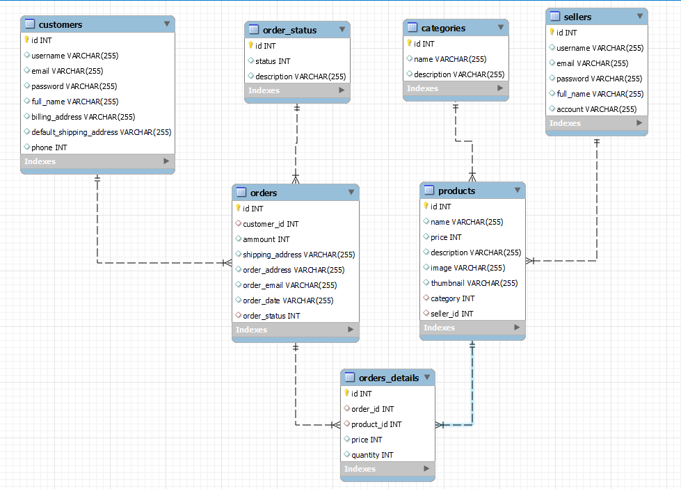
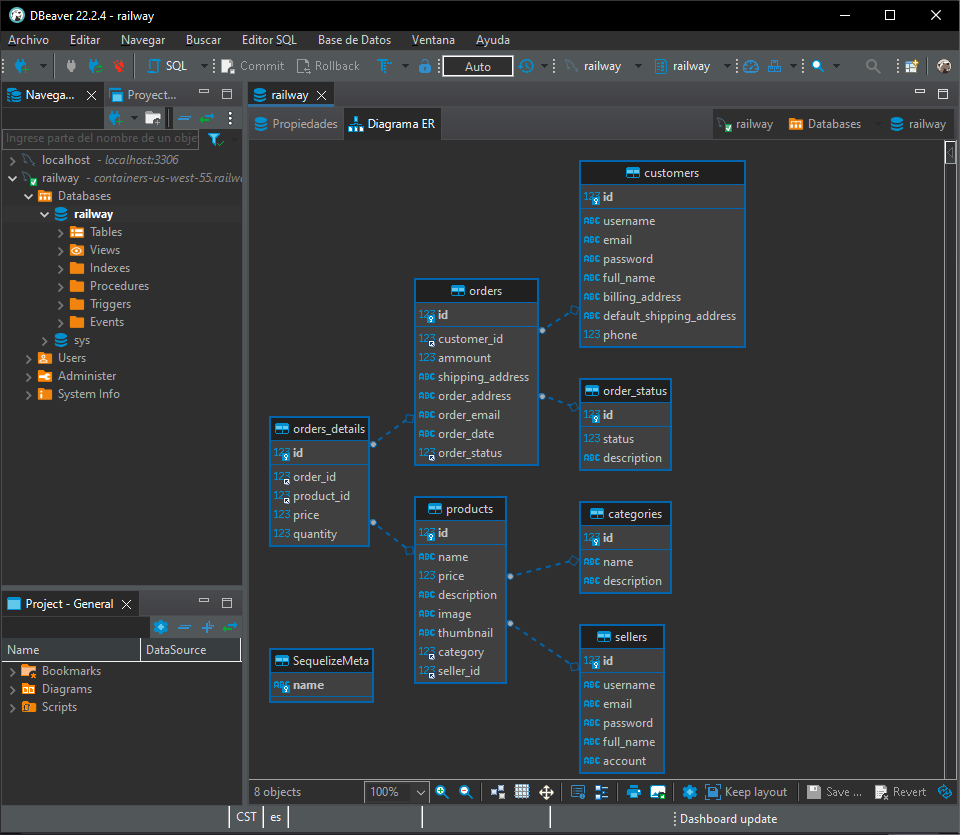
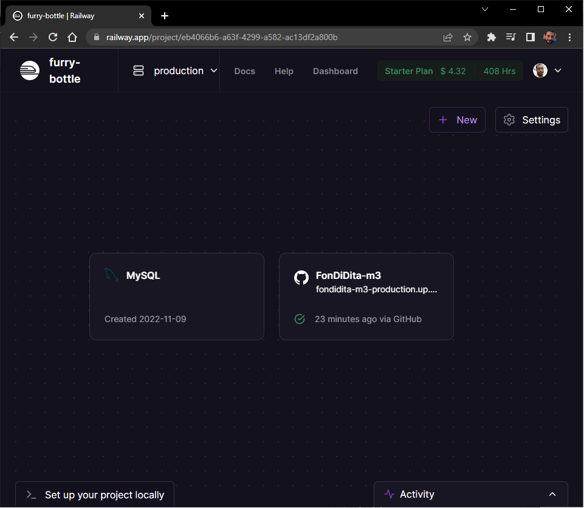
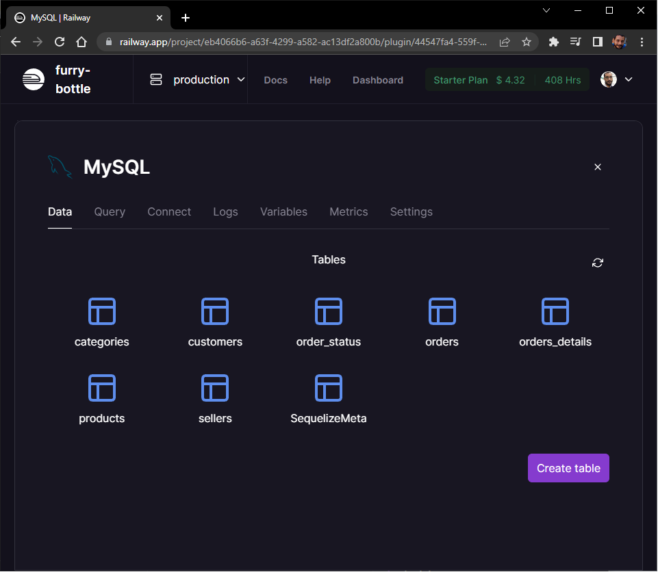
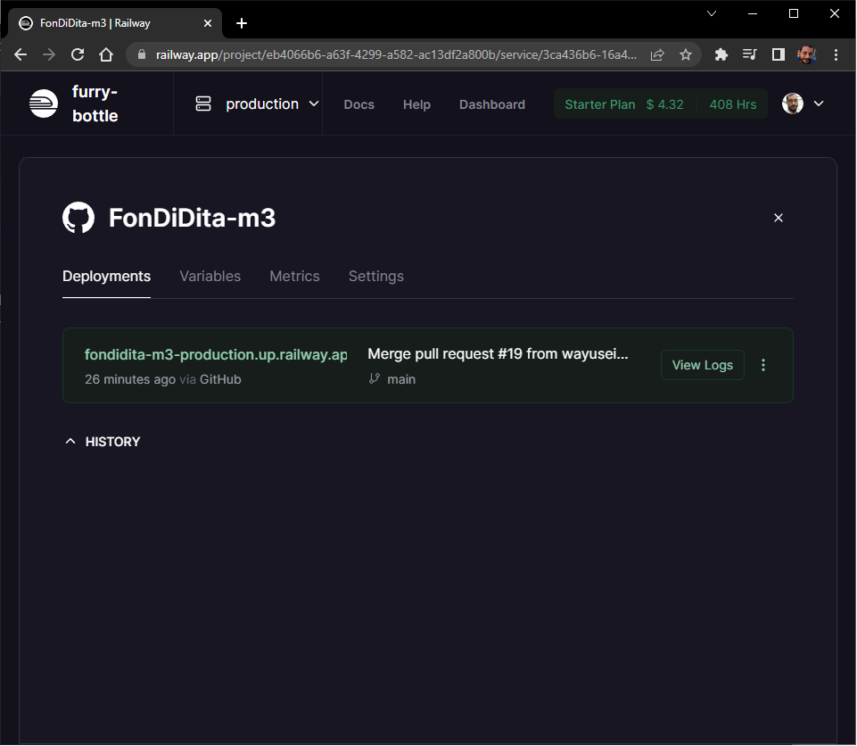

# FonDiDita v 2.0

*Evaluación del módulo 1 Fase 3 - Backend con Node.js + React, Desarrollo Web Fullstack | Santander Universidades*

## Definición de herramientas 

 ### Herramientas utilizadas: ¿Qué son y para qué sirven?

 - **MySQL** es un sistema de gestión de bases de datos que cuenta con una doble licencia. Por una parte es de código abierto, pero por otra, cuenta con una versión comercial gestionada por la compañía Oracle.
  
 - **JavaScript**: Es un lenguaje de programaciòn ligero, interpretado, o compilado ‘justo-a-tiempo’ (just-in-time) con funciones de primera clase, basado en prototipos, multiparadigma, de un solo hilo, dinámico, con soporte para POO, imperativa y declarativa.Sirve para scripting en páginas web, en entornos fuera del navegador como Node.js, Apache CouchDB y Adobe Acrobat.
  
 - **Node.js**: Es un entorno de ejecución para Javascript construido con V8, motor de Javascript de Chrome, es open source, multiplataforma y se ejecuta del lado del servidor, sirve para crear sitios web dinámicos muy eficientes usando JS.

 - **npm**: NPM corresponde a las siglas de Node Package Manager, manejador de paquetes de node, sirve para compartir e instalar paquetes de software entre distintos proyectos que utilicen Node.JS.

 - **Sequelize**: Es un ORM, Object-Relational Mapping - mapeo objeto-relacional, sirve para manipular varias bases de datos SQL de una manera bastante sencilla, utilizando JS en este caso.

 - **Express.js**: Es un framework backend minimalista, diseñado para construir una aplicación de manera ágil, sirve para proporcionar funcionalidades como el enrutamiento, opciones para gestionar sesiones y cookies, etc.
  
 - **Github**: Es un portal creado para alojar el código de las aplicaciones de cualquier desarrollador que utiliza el sistema de control de versiones Git, es multiplataforma y tiene multitud de interfaces de usuario, sirve para que los desarrolladores suban el código de sus aplicaciones y herramientas.
  
 - **Railway app**: Railway es una plataforma de deployment dónde puedes tener acceso a infraestructira, desarrollar localmente y hacer deploy en la nube
  
 - Además utilizamos para comunicarnos la plataforma de videoconferencias Zoom, la aplicación de mensajería instantánea **WhatsApp** y la plataforma **Google Drive** para mediante un documento compartido apoyarnos a la redacción de este documento.

---

## Diagrama ERD de la BBDD

## Vista de la BBDD utilizando programa DBeaver

---
## Para la demostración de los servicios de la API utilizamos Insomnia

## Deploy en Railway

## BBDD MySQL en Railway

## Servidor en Railway desplegado desde el repositorio en Github

# Integrantes del equipo de FonDiDita  👨‍💻👨‍💻👨‍💻👨‍💻

- Sergio Monterrubio
- Ángel Pimentel
- Rodrigo Rosas
- Julio Alberto Hernández

## Visitar la app en Railway: [Fondidita-m3](https://fondidita-m3-production.up.railway.app/)